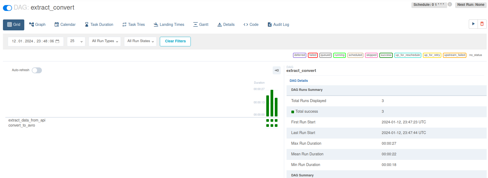

# airflow-sales-processing

The main goal of this project is to write jobs that:
* collects sales data (API) and saves it to the raw/ directory;
* converts JSON files from raw/ directory to AVRO format and saves to the stg/ folder.

## Jobs description
Requirements for the first job:
* API is accessible using the link: https://fake-api-vycpfa6oca-uc.a.run.app/;
* In main.py Flask-based web server should be implemented, which takes POST requests on 8081 port;
* Web server takes as an argument JSON like:
`json={
          "date": "2022-08-09",
          "raw_dir": RAW_DIR
      }`
* Saving path looks like `/path/to/my_dir/raw/sales/2022-08-09`. It is fed as a `RAW_DIR` parameter;

* Job has to be idempotent.

Second job' requirements:
* Job starts by POST request on localhost:8082 with 2 parameters in JSON object: `raw_dir` and `stg_dir`;
* `stg_dir` should look like `/path/to/my_dir/stg/sales/2022-08-09`;
* `raw_dir ` is the same as for the first job.

After starting both servers `bin/check_jobs.py` script can be run for a correctness check.

## Airflow DAGs description
This part is dedicated to the description of two Airflow DAGs that allows us to orchestrate previously created jobs to make it run periodically.
### process_sales.py
File contains DAG with `dag_id='process_sales'` which consists of two tasks:
* `task_id=”extract_data_from_api”` - triggers the first job;
* `task_id=”convert_to_avro”` - triggers the second one.

A pipeline processes data over 3 days: from 2022-08-09 till 2022-08-11.

Execution results:

### load_csv_to_gcp.py
This file contains Apache Airflow pipeline that loads AVRO fiels (second job output) onto a Google Cloud Storage.

Pipeline should take two days data, load it into a bucket with the next structure: `src1/sales/v1/2022/08/01/`.

`PythonOperator` can not be used.

Execution results:

